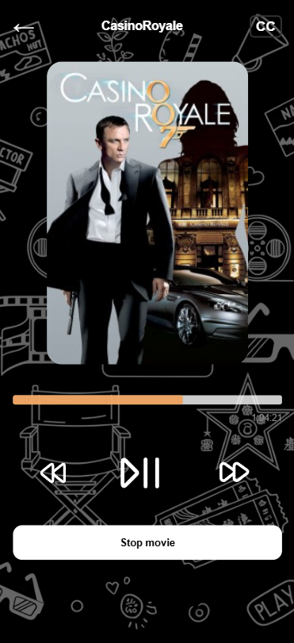

# Webserver video player

Raw ipc socket video player, cpp mpv code runs as just a window that we can communicate to via our python webserver.

## Installation steps
For now this  is unneccessary since it's mostly to be used in conjuction with the retro-gaming linux repository I have on my github. However it's currently made in windows so if you do want to run it here are the steps.

First for windows you will need the mpv .dlls and move it into the deps folder you have to create inside root.
Afterwards just run the following commands

```
.\buildAndRun.ps1
```

This will build the player and open the window.
Afterwards just run the flaskwebserver, you will need to install all neccessary packages inside of requirements.txt

```
python remote.py
```

## Video locations
Whatever you want to play has to be in the folder "movies" inside of the root, please create the folder and place your content. Currently the name of the folders is automatically what is picked up by the player as the "title".

* Organization: Place each movie in its own subfolder.

* Titles: The player automatically uses the folder name as the movie title.

* Posters: Ensure each folder contains a .jpg file to be used as the gallery thumbnail.

## Usage and information




Afterwards you can open the webserver URL that flask has provided you, where you will see the screen with movie selection. 

Open the webserver URL provided by Flask in your browser.

* Select a movie from the gallery. It will start playing automatically in the C++ player window.

* Controls: From your browser, you can:

    * Pause/Play playback.

    * Seek ±10 seconds via buttons.

    * Use the interactive progress bar for absolute seeking.

    * Toggle closed captions (CC).

## Legal disclaimer

Important: This software is intended strictly for personal, educational, and non-commercial use.

* Copyrighted Material: Any movie titles, images, or posters shown in the screenshots or documentation are used for demonstration purposes only. All intellectual property rights belong to their respective owners.

* Compliance: Users are responsible for ensuring they have the legal right to play any content loaded into the "movies" directory. The author does not condone or facilitate copyright infringement.

* Liability: The author is not responsible for any misuse of this software or for any legal issues arising from the use of copyrighted material.