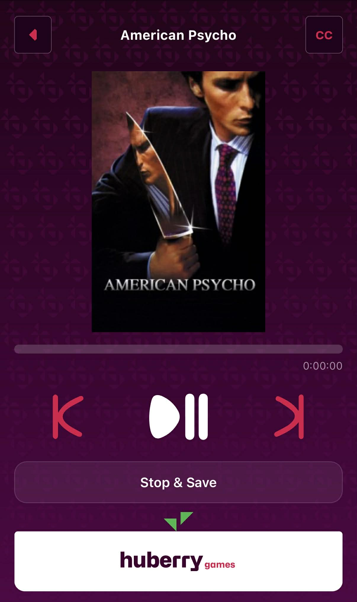
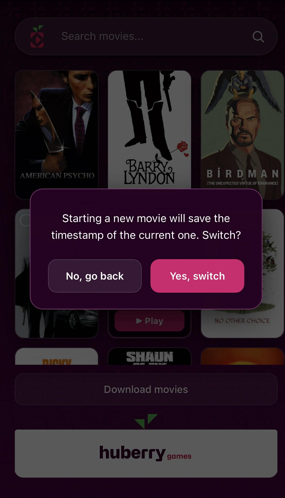

# Huberry Stream

A phone-controlled movie player built around MPV. A C++ process runs MPV as a bare window with an IPC socket exposed, and a Flask webserver lets you control it from any browser on the same network, intended to be used as a phone remote.

Built to run on a Raspberry Pi 5 as part of a larger retro-gaming Linux setup, but also works standalone on Windows during development.

<p align="center"></p>

---

## Installation

This is primarily meant to be used alongside the retro-gaming Linux repository. For standalone Windows use:

**1. Build the C++ player**

Place the MPV `.dll` files into a `deps/` folder in the project root, then run:

```
.\buildAndRun.ps1
```

This compiles and opens the player window.

**2. Start the Flask server**

```
/venv/scripts/Activate.ps1

python remote.py
```

Install dependencies first if needed: `pip install -r requirements.txt`

---

## Movie library

Each movie lives in its own subfolder inside `movies/` at the project root.

- **Title** — taken automatically from the folder name
- **Poster** — any `.jpg` file found inside the folder is used as the gallery thumbnail
- **Subtitles** — `.srt` files in the folder are available via the CC button in the remote
---

## Features

<p align="center">  </p>

**Gallery**: Searchable 3-column movie grid. Tap any poster to see information about it and play it.

**Remote control**: Once a movie is open, the browser becomes a remote:
- Play / Pause
- Skip ±10 seconds
- Tap anywhere on the progress bar to seek to that position
- Toggle subtitles (CC)
- Stop & Save: stops playback and saves your position

**Movie switching**: tapping a card while something is already playing has three behaviours:
1. Same movie → jumps to the remote view instantly, no reload
2. Different movie → a confirmation dialog appears before switching, and your current position is saved automatically
3. Nothing playing → loads immediately

---

## Legal disclaimer

This software is intended strictly for personal, educational, and non-commercial use.

- Any movie titles, images, or posters shown in screenshots or documentation are used for demonstration purposes only. All rights belong to their respective owners.
- Users are responsible for ensuring they have the legal right to play any content loaded into the movies directory.
- The author is not responsible for any misuse of this software or legal issues arising from use of copyrighted material.